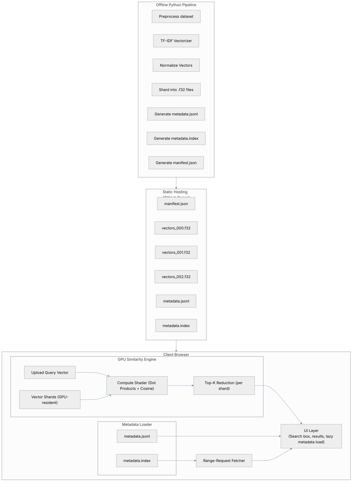

# Vector Similarity Search in the Browser (WebGPU)

This project demonstrates a **client-side vector similarity search engine** running in the browser using WebGPU.

Given 90k rows CSV (300+Mb) dataset of Indonesian news (2024-2025), the user is able to query all news titles and get best the best matches based on vector-similarity search.  

## Static Data Store In Github Page

The dataset used in this demo contains rows of Indonesian news data:
- title
- content
- date_published
- link

For this demo, only the title field is vectorized.

Each of news title is represented as `1000 dimension` vector by Scikit Learn's **TF-IDF** (Term Frequency–Inverse Document Frequency).
This produces sparse but meaningful numerical vectors representing the text title. The vectors are normalized for easier computation.

These precomputed vectors are then:
- Sharded into few `.f32` binary files
- Stored in static Github page. Along with other data:
  - `manifest.json`: Describes vector shards' dimensions, count, and size.
  - `metadata.jsonl`: JSON Lines copy of the CSV dataset.
  - `metadata.index`: Map of `dataset row index` to `jsonl byte offset`. 
  - `vocab.json` and `idf.32`: Vocab and TF-IDF's model to vectorize client-side's query.

Vector Sharding & Format
- Vectors are stored as `float32` shards
- Vector dimension: 1000
- Shards of ~8k vectors per file
- Layout: row-major contiguous float32 arrays
- File extension: `.f32`

Checkout the repository for the static data here: [https://github.com/hariswb/indonesian-news-2024-2025](https://github.com/hariswb/indonesian-news-2024-2025)

## Client-side WebGPU Compute Shader Pipeline

It works as follows:
- User opens the client [https://hariswb.github.io/webgpu-vector-search/](https://hariswb.github.io/webgpu-vector-search/).
- The pipeline load the vector shards and pass them into WebGPU buffers. This is done once at the initialization.
- The pipeline vectorize the user's search query into `1000 dimension` vector. 
- The pipeline computes the query vector against all vector shards. Then, it will output the scores.   
- The scores are sorted and remapped to the dataset indexes.
- The client fetch the highest scoring row, K entries at a time, with `http range request` to the static page.

# Compute Pipeline Architecture
Diagram



As the client React app is initialized and the dataset manifest is fetched, the compute pipeline is created. It runs a series of processes:

## Initial Buffers
WebGPU engine is responsible for:
- Allocating buffers at initialization:
  - `paramsBuffer`: `dimension` and `count` of vectors in each shards.
  - `queryBuffer`: `Float32Array` of vectorized search query.
  - `vectorShardBuffers[]`: Vector shard buffers. Each shard has 8k vectors. 
  - `readbackBuffer`
  - `outputBuffer`

The vector shards can be large (32Mb). The pipeline should pass them to the buffers only once at the pipeline initialization. The engine uses `mappedAtCreation: true` for persistency.

Checkout `src/gpu/engine.ts`.

## Computation
When the pipeline is initialized, it's ready to accept user's search query. 

For each shard:
- Search query is vectorized.
- The query vector is passed to `queryBuffer`.
- `WebGPU` Compute shader apply dot product for every vector in shard against the query vector. 
  - Since the vectors are normalized, it only gets the sum.
- Writes similarity scores to output buffer

Here is the compute shader script:
```wgsl
struct Params {
  dim: u32,
  count: u32
};
@group(0) @binding(0) var<uniform> params: Params;
@group(0) @binding(1) var<storage, read> query: array<f32>;
@group(0) @binding(2) var<storage, read> vectors: array<f32>;
@group(0) @binding(3) var<storage, read_write> out: array<f32>;

@compute @workgroup_size(64) fn main(@builtin(global_invocation_id) gid: vec3<u32>) {
  let i = gid.x;
  if (i >= params.count) {
    return;
  }

  var sum: f32 = 0.0;
  let d: u32 = params.dim;
  let base: u32 = i * d;
  var k: u32 = 0u;
  loop {
    if (k >= d) { break; }
    sum = sum + query[k] * vectors[base + k];
    k = k + 1u;
  }
  out[i] = sum;
}
```

## Readback
After GPU dispatch, scores outputted to `outBuffer` and ready to be copied to `readbackBuffer` for CPU to read.

## K-Top Ranking on CPU
Performs sorting on scores and map them to the shards' indexes.

## HTTP Range Requests

The copy of original CSV dataset is stored in:
  - `metadata.jsonl`
  - `metadata.index`

The client reads the byte offsets from the result indexes and uses HTTP Range Requests to fetch only the specific metadata lines needed. Range Requests is used because Github Page is static and we only need a `K` number of entries at a time.  

# Performance

Using vitest's bench, I test some processes involved in the compute pipeline. Checkout `src/test/pipeline.bench.ts`.

| Component                               | Samples     | Mean (ms)   |
|-----------------------------------------|-------------|-------------|
| Load & upload vector shards to GPU *    |   Approx    | ~1400-2000  |              
| TF-IDF vectorization of query           |   46935     | 0.01        |
| GPU similarity compute (90k × 1000 fp32)|     10      | 198.29      |
| Extract compute result and sort         |      77     | 75          |
| Fetch result to static page (K = 10)*   |      22     | 23          |

Note:
*Involves fetch to static page, subject to network latency. 

# Limitations

Limitations in this demo:
- Static data only (no live updates)
- TF-IDF vectors may not capture semantic meaning as well as embeddings
- Requires a browser with WebGPU enabled
- Cannot filter results in the static github page side
- Not optimized for extremely large datasets (>1M vectors)

# Credits
WebGPU explainers:
- https://gpuweb.github.io/gpuweb/explainer/
- https://webgpufundamentals.org/webgpu/lessons/webgpu-fundamentals.html

Dataset:
Thanks to sh1zuka for the 90k Indonesian datasets
- https://www.kaggle.com/datasets/sh1zuka/indonesia-news-dataset-2024

# License

MIT License
