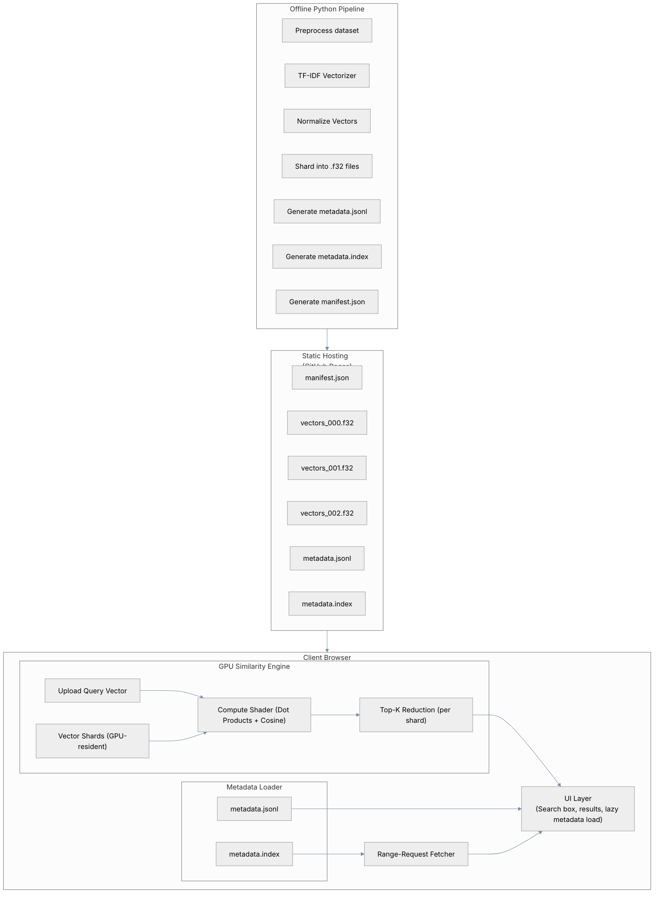

# Vector Similarity Search in the Browser (WebGPU)

## Introduction

This project demonstrates a **client-side vector similarity search engine** running entirely in the browser using WebGPU.

The dataset used in this demo contains rows of Indonesian news data:
- title
- content
- date_published
- link

For this demo, only the title field is vectorized.

The titles are converted into high-dimensional vectors using **TF-IDF** (Term Frequency–Inverse Document Frequency).
This produces sparse but meaningful numerical vectors representing the text content.

These precomputed vectors are then:
- sharded into multiple `.f32` binary files
- loaded into GPU buffers inside the browser
- used for cosine similarity computation between the user’s search query and all news titles

The entire similarity search runs inside the browser with WebGPU, without a backend server.


## Motivation

Running vector search on the CPU in the client is possible, but becomes slow as the dataset grows:
- Computing similarity against tens of thousands of vectors, in this case 90k rows
- Repeatedly processing 1000-dimensional vectors
- Sorting and ranking results

Executing these operations on the CPU would noticeably block the UI.

WebGPU allows these computations to run massively in parallel, giving:
- Much higher throughput
- Smoother UI
- Ability to scale to larger datasets

This project explores how client-side vector search using GPU-accelerated compute shaders work and pointing out the limitations.

## Challenges
### Loading Large Vector Shards

**Challenge:**
Compute shaders are extremely fast, but loading large vector shards on demand introduces noticeable latency.

**Solution:**
All vector shards are fetched once at initial load and stored permanently in WebGPU buffers, similar to loading meshes in a WebGL/3D engine.

This ensures each search query runs without any network delay.

### Data Fetching After Similarity Search

**Challenge:**
After computing similarity and ranking top-K indices, we still need to fetch actual data (title, content, link). We are using static github page for this demo, so index search is out of question. Fetching full JSON chunk upfront and filter the result for the desired indices is very slow.

**Solution:**
Use HTTP Range Requests to fetch only the lines relating to the selected top-K documents from a static site.
Combined with the `.index` file, the browser fetches precise byte offsets instead of the entire metadata file.

### Other Technical Challenges

- WebGPU requires careful buffer lifetime management
- Sharding must align with GPU-friendly sizes
- Precision differences between CPU TF-IDF and GPU computation
- Efficient K-top ranking on the CPU after GPU computation
- Maintaining good user experience despite static-hosting constraints

## Features

Users can:
- Type a search query into the UI
- Automatically generate a TF-IDF vector from that query
- Run WebGPU-accelerated similarity search against all news title vectors
- View top-K most similar news items
- Lazy-load metadata (title, date, link) via byte-range queries
- Interact with a responsive and fast search experience

## Architecture
Diagram




### Flow Overview (Bullet Points)
- The UI loads and initializes the WebGPU engine
- Vector shards (.f32) are fetched once and uploaded to persistent GPU buffers
- Metadata index + JSONL are prepared for ranged fetching
- User enters a search query
- The query is vectorized on CPU using the same TF-IDF vocabulary
- GPU compute shader calculates cosine similarity against all vector shards
- Results are read back to CPU
- CPU performs top-K ranking
- UI fetches only needed metadata via HTTP range requests
- UI displays results

### Repositories Overview

There are two repositories involved:

#### I. Static Data Generation

https://github.com/hariswb/indonesian-news-2024-2025

This repo contains the Jupyter notebooks and data pipeline responsible for:
- Cleaning and preprocessing the news dataset
- TF-IDF vectorization of the title field
- Vector normalization
- Vector sharding into .f32 binary files
- Creating metadata.jsonl
- Creating metadata.index (byte offsets for each line)
- Generating manifest.json (describes all data files, dimensions, shard sizes)
- Publishing the static data to GitHub Pages

This repository is used solely for preparing data for the WebGPU client.

#### II. Client Side Vector Similarity Pipeline

(This repository)

A Vite + React application for UI and custom pipeline with GPU-accelerated vector search implementation.

### Workflow Overview
#### App Initialization
- The app loads the manifest
- All vector shard .f32 files are downloaded
- Shards are uploaded into persistent WebGPU buffers
- Metadata index is loaded
- The search UI becomes interactive

#### Vector Sharding & Format
- Vectors are stored as:
- `float32`
- dimension: 1000
- shards of ~8k vectors per file
- layout: row-major contiguous float32 arrays
- file extension: `.f32`

This format is chosen because:
- directly compatible with GPU storage buffers
- very fast to upload
- fixed-type, zero parsing
- small enough to be hosted on GitHub Pages

#### Project Structure
```
/src
  ui/
    App.tsx
  stores/
    storeGithubPage.ts
  gpu/
    engine.ts
  test/
    pipeline.test.ts
  utils/
    tfIdf.ts
  pipeline.ts
  main.tsx
```

Notes:
- Built using Vite
- UI built in React
- Uses a custom data pipeline for loading vector shards and metadata
- Uses Vitest for testing pipeline logic

#### GPU Engine

The GPU engine is responsible for:
- Initialization
- Creating GPU device, queues
- Allocating buffers:
    - paramsBuffer
    - queryBuffer
    - vectorShardBuffers[]
    - outputBuffer
    - readbackBuffer

- Vector shard buffers use `mappedAtCreation: true` for persistent mapping
- Shards remain GPU-resident for the lifecycle of the app

Computation
- For each shard:
- The query vector is uploaded
- Compute shader runs:
    - dot product between query and each vector
    - apply cosine similarity normalization
- Writes similarity scores to output buffer

Readback
- After GPU dispatch, scores are copied into readbackBuffer
- Data is read on CPU and used for ranking

K-Top Ranking on CPU
- CPU receives all similarity scores
- Performs a partial sort / selection algorithm
- Produces top-K indices
- These indices are used for metadata requests

HTTP Range Requests
- Metadata is stored in:
    - metadata.jsonl
    - metadata.index
- After ranking:
    - The browser reads byte offsets from the index
    - Uses HTTP Range Requests to fetch only the specific metadata lines needed
    - Minimizes network usage
    - Avoids loading full metadata into memory

Why Range Requests Help in This Demo
- GitHub Pages cannot serve dynamic APIs
- Metadata file can be large (MBs)
- Fetching only 10–20 records makes the UI feel instant
- Works well with static hosting environments

## Performance

Below are rough performance measurements from the demo environment:

| Component                               | Approx. Time |
|----------------------------------------|---------------|
| Load & upload vector shards to GPU     | ~120–180 ms   |
| TF-IDF vectorization of query          | ~1–3 ms       |
| GPU similarity compute (90k × 1000 fp32) | ~3–6 ms       |
| Readback of similarity scores          | ~1–2 ms       |
| CPU Top-K selection (K = 10)           | ~0.2–0.5 ms   |
| Metadata fetch (10 items via Range)    | ~30–80 ms     |


## Limitations

- Static data only (no live updates)
- TF-IDF vectors may not capture semantic meaning as well as embeddings
- Requires a browser with WebGPU enabled
- Not optimized for extremely large datasets (>1M vectors)

## Credits
WebGPU explainers:
- https://gpuweb.github.io/gpuweb/explainer/
- https://webgpufundamentals.org/webgpu/lessons/webgpu-fundamentals.html

Dataset:
Thanks to sh1zuka for the 90k Indonesian datasets
- https://www.kaggle.com/datasets/sh1zuka/indonesia-news-dataset-2024

## License

MIT License

